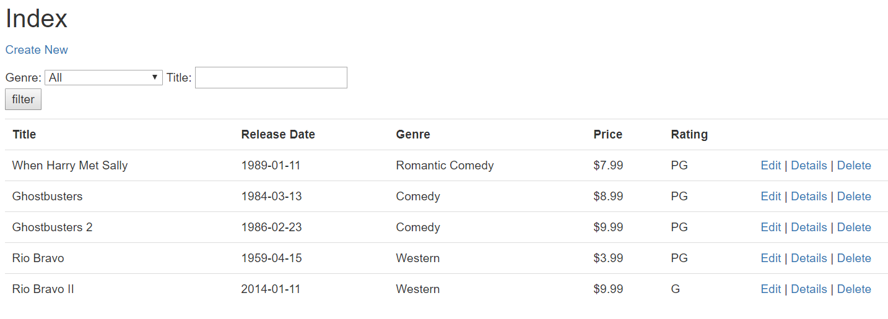
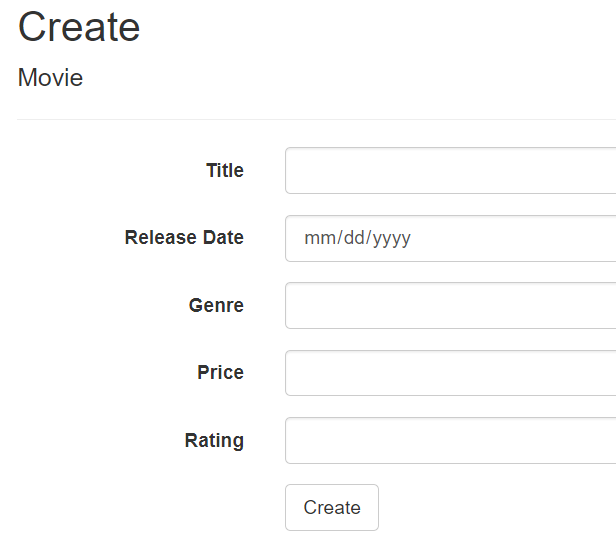
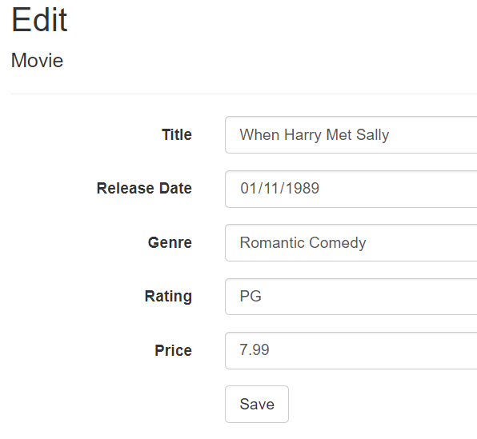
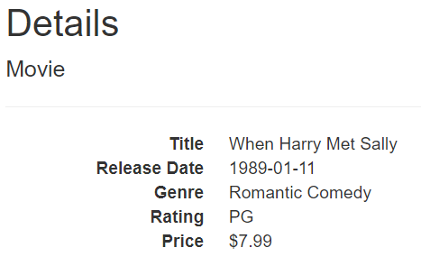
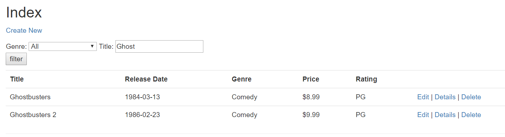
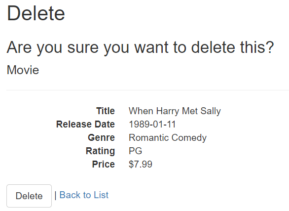

# Lab41_MVC5

## Summary
This application is from following a tutorial on how to build a website in ASP.NET using MVC.  
MVC stands for Models, Views, Controllers which represents a way to separate the variables 
(using the idea of separation of variables).  
To get to the part that was written for the tutorial, click on "MVC Movie" in the navigation bar.  

## Visual
Here are some images of the application in progress:  
Index page for the movies:  
  

Create page:  
  

Edit Movie Page:
  

Detail Page:  
  

Search Page:  
  

Delete Page:  
  

## How to use:
1. Download Visual Studio  
2. Clone the GitHub Repository: "Lab41_MVC5"
3. Open the sln file: "MVCMovie.sln" in Visual Studio
4. In the "Debug" menu, press the "Start Without Debugging" option
5. Click on "MVC Movie" in the navigation menu